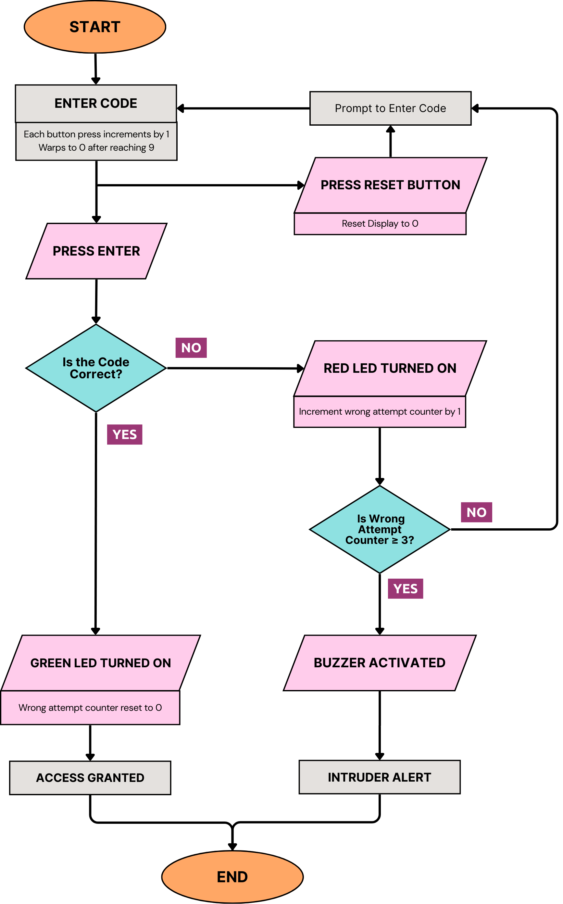
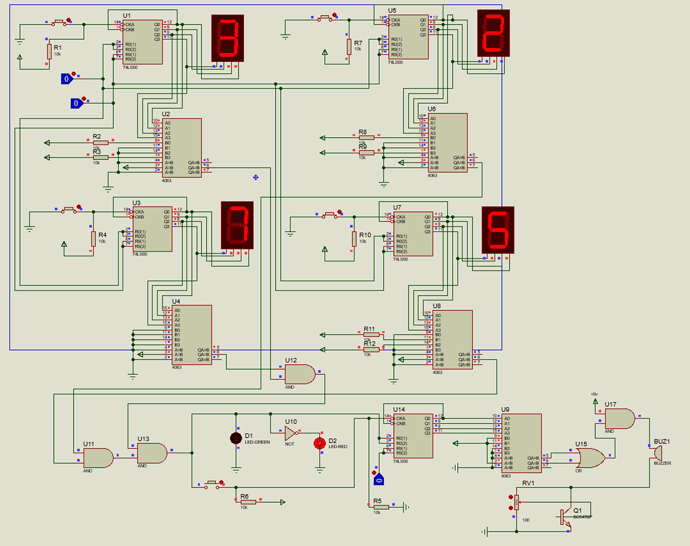

# Code_Locker_cald

A password-protected system using only digital logic components, without any microcontrollers or software, for tamper-proof access control. 

## System Architecture

The system is built around fundamental digital logic components working together to create a secure access control mechanism:

#### Input Processing
- **4-bit Binary Password Input**: Push buttons representing binary digits (0 = released, 1 = pressed)
- **Schmitt Trigger Inverters (74LS14)**: Clean and debounce button signals to prevent false triggers
- **Real-time Display**: 7-segment display showing hexadecimal digits (0-F) using BCD-to-7-segment decoder (74LS47)

#### Authentication Logic
- **4-bit Magnitude Comparator (74LS85)**: Continuously compares entered code against hardwired preset password
- **Visual Feedback**: Green LED for success, red LED for failed authentication
- **Reset Function**: Clear button that pulls connected lines to ground

#### State Management
- **4-bit Counter (74LS90)**: Acts as event counter and state tracker, configured to count from 0-9 (BCD)
- **Asynchronous Operation**: Immediate response to user inputs without clock edge delays

## Technical Implementation

### Signal Processing Circuitry

#### Input Conditioning
The system employs Schmitt trigger inverters (74LS14) for signal conditioning:

- **Hysteresis Effect**: Built-in buffer zones with different thresholds (2V rising edge, 0.8V falling edge at 5V supply)
- **Debouncing**: Eliminates mechanical switch contact bounce through voltage thresholding
- **Signal Squaring**: Converts noisy analog signals into clean digital transitions
- **Immediate Response**: State changes propagate without waiting for clock edges

#### Password Verification
The 74LS85 comparator provides continuous password checking:

- **Parallel Evaluation**: Zero delay comparison after input changes
- **Exact Match Requirement**: Equality output (A=B) goes high only when all four bit pairs match exactly
- **Cascading Capability**: Multiple chips can be cascaded for longer passwords while maintaining hardware-only design

### Component Details

#### 74LS14 Schmitt Inverter
- **Function**: Six independent Schmitt trigger inverters for signal conditioning
- **Output**: Clean logic-high or logic-low signals when input crosses voltage thresholds
- **Reliability**: Provides dependable digital inputs to downstream logic circuits

#### 74LS90 Counter
- **Configuration**: Asynchronous decade counter (0-9) or divide-by-2/divide-by-5
- **Operation**: Advances on falling edge of clock pulses
- **Reset Function**: Reset to zero by setting R0 and R1 pins high
- **Output**: Four bits (QA-QD) representing current count in binary form
- **Application**: Tracks button press attempts and maintains system state

#### 74LS85 Comparator
- **Function**: 4-bit magnitude comparator with three outputs (A>B, A<B, A=B)
- **Password Verification**: Equality output (A=B) indicates successful authentication
- **Parallel Processing**: Simultaneous evaluation of all bit pairs
- **Expansion**: Cascade inputs allow password length extension

## Supporting Circuitry

### Resistors
- **Pull-up/Pull-down Resistors (10kΩ)**: Maintain defined logic levels when buttons are unpressed
- **Current Limiting Resistors (470Ω)**: Protect LEDs and 7-segment displays from overcurrent
- **Brightness Control**: Adjust display brightness to required levels

### Capacitors
- **Debouncing Capacitors (0.1μF)**: Smooth mechanical switch contact bounce
- **RC Delay**: Filter button press glitches for clean digital transitions
- **Power Supply Decoupling (0.1μF ceramic)**: Stabilize voltage to ICs by absorbing high-frequency noise

## Operating Principles

### Authentication Process
1. User enters 4-bit binary password using push buttons
2. Schmitt trigger inverters clean and debounce input signals
3. 7-segment display shows entered code in hexadecimal format
4. 74LS85 comparator continuously checks entered code against preset password
5. Green LED indicates success, red LED indicates failure
6. Reset button clears current input and returns system to initial state

### Real-time Feedback
- **Immediate Display**: 7-segment shows current input without tracking wrong attempts
- **Visual Indicators**: Clear success/failure signals through colored LEDs
- **No Attempt Tracking**: System focuses on current authentication rather than historical attempts

## Technical Specifications

- **Password Length**: 4-bit binary (16 possible combinations)
- **Display Format**: Hexadecimal (0-F) on 7-segment display
- **Power Supply**: 5V DC standard TTL logic levels
- **Input Method**: Push buttons with pull-up/pull-down resistors
- **Output Indicators**: Green (success) and red (failure) LEDs
- **Reset Function**: Immediate clearing of current input
- **Operating Temperature**: Standard TTL operating range

##  System Limitations

1. **Fixed Password**: Password cannot be changed without physical modification
2. **Scalability Challenges**: Complex passwords require exponentially more circuitry
3. **Physical Access Required**: Changes and maintenance need direct physical access
4. **Power Dependency**: Requires continuous power or battery backup

**Algorithm:**

**Circuit Design:**

**Schematics:**

